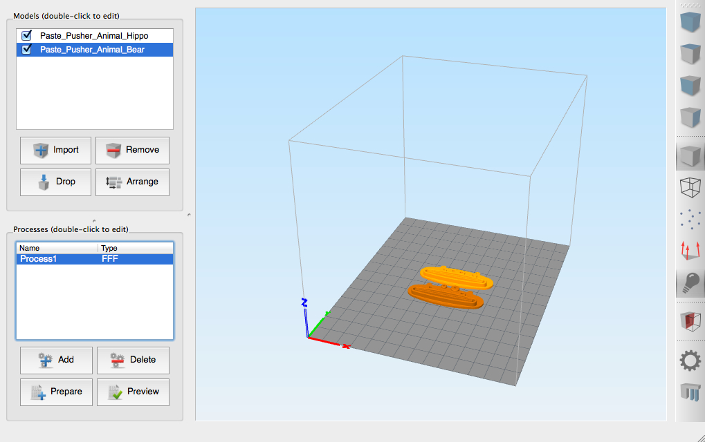
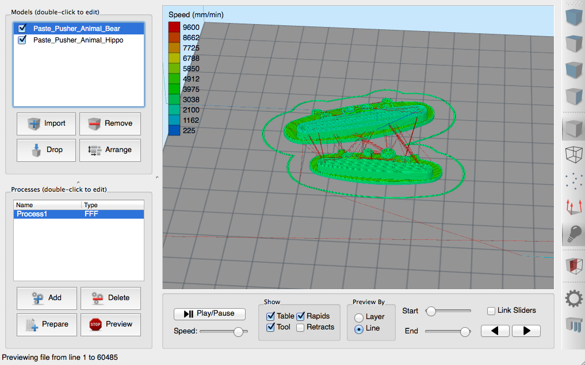
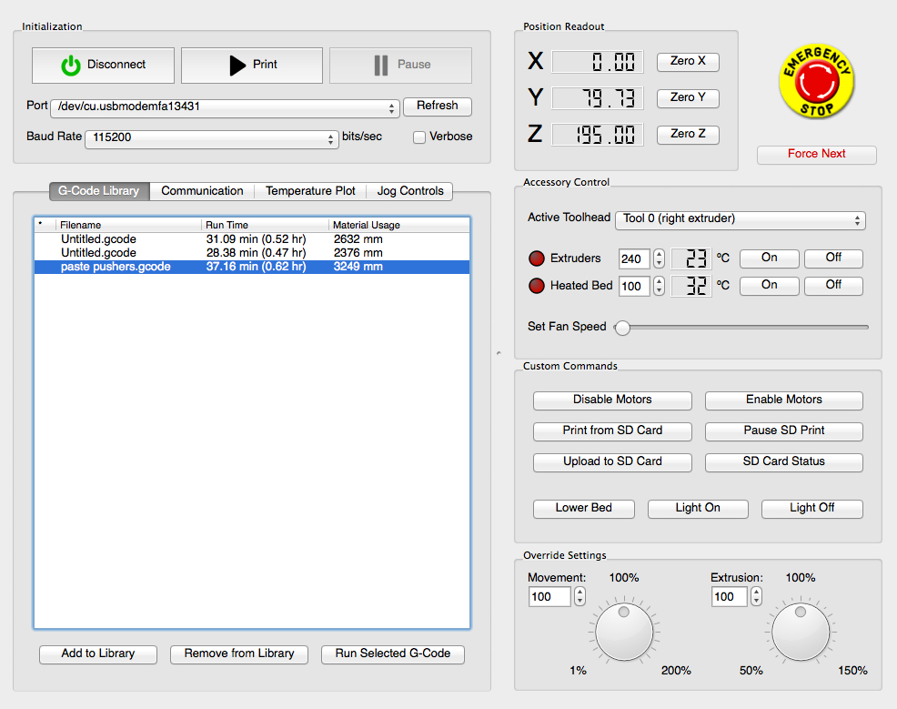
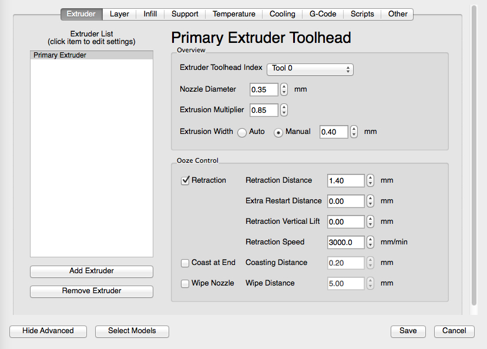
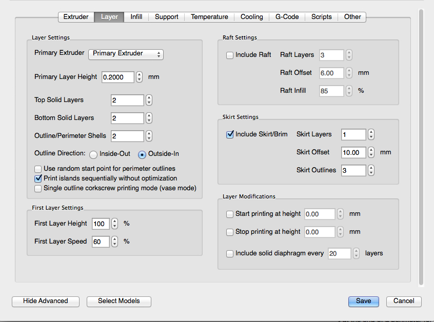
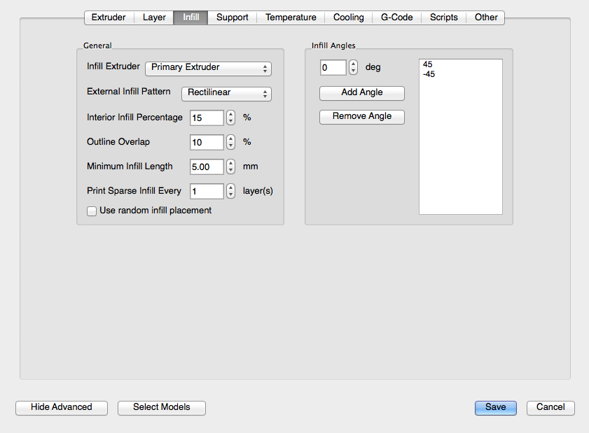
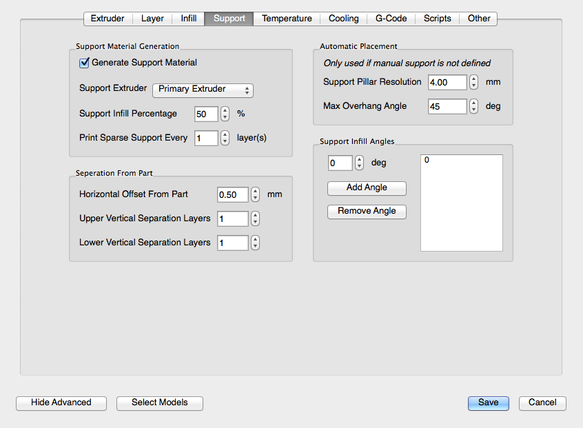
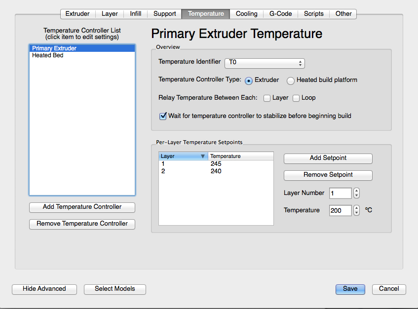
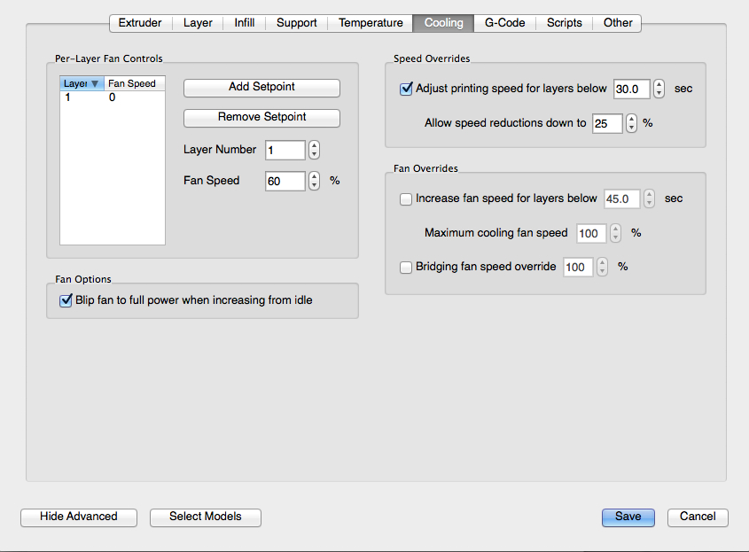

# Unofficial Simplify3D Documentation

[Simplify3D](http://www.simplify3d.com/) is a commercial slicer and 3D printer host. It has a number of useful features, but figuring out what everything does can be a daunting task for someone who is not already familiar with 3D printing. This document is an attempt to fill some of the gaps. It is not officially sanctioned by or affiliated with Simplify3D.

I am using a Mac; some of the keyboard shortcuts may be different on Windows or Linux.

## Tutorials

There are a number of [tutorials](http://www.simplify3d.com/support/tutorials/) on Simplify3D's web site that cover various aspects of the software. Go through those first.

## The Interface

### Models Section

The Models area is where you specify the 3D model files you want to work with. Use Import or drag and drop files into the list area to add files. Remove files with the Remove button. The checkboxes next to the file names hide and show that file in the preview area. Double click on the filename or on a model in the preview area to view and edit its properties (rotate, scale, position, dimensions).

When moving objects around, they may no longer be positioned on the floor. The Drop button makes sure everything has its lowest point on the floor.

The Arrange button auto-arranges all visible models in a compact cluster around the center of the printing area.

### Preview Area

The preview area in the center displays your models as they will be printed. The size of your printing area should be configured in the Preferences menu under the Machine tab. You can directly manipulate your models in this window.

* Left drag rotates the view.
* Right drag translates the view.
* Shift-left drag zooms in and out, as does the scroll wheel.
* Click on a model to select it.
* Alt-left-drag left and right on a model to rotate it.
* Cmd-left-drag on a model to move it around the bed. The camera will shift temporarily to an overhead viewpoint while you move it around.
* Cmd-right-drag up and down on a model to scale it.

Double clicking on a model will bring up an options screen to let you do all of the above transformations more precisely using numbers.

When previewing a g-code file (described in the next section), the preview area displays a representation of the actual instructions that will be sent to the printer. You can virtually play back how the print will progress using the controls that appear underneath.

Under _Show_ are a set of checkboxes that determine what appear in the gcode preview. Table toggles the gray gridded plane which represents your printer bed. Tool shows and hides the virtual tool head representing your extruder. Rapids displays travel moves (when your extruder is not laying down plastic) as red lines, indicating high speed moves. Retracts shows and hides small spheres where retract moves occur, when the extruder goes into reverse to suck up plastic so that it doesn't ooze out during a travel move.

_Preview By_ chooses whether you would like the playback to advance line by line or layer by layer. The Start and End sliders allow you to manually display a range of the gcode file to be shown. You can use them to manually inspect specific areas of your print. _Link Sliders_ moves the two sliders together, so that you are only viewing a line or layer at a time. It is generally only useful when Preview By is set to layer, as otherwise nothing other than the tool head will be shown. The two arrow buttons allow you to step forward and back one line or layer at a time.

### Toolbar

The right side toolbar gives you quick access to some common functions. The first set of buttons moves the camera to set locations: a default zoomed out view, and top, front and side views.

The next four buttons change how the model is displayed: as a solid, wireframe, point cloud, or face normals. Usually this is left in solid mode, but some of the other views can be useful when viewing complex models. Note that it is possible to have none of the view modes selected, in which case nothing will be visible.

The light bulb turns lighting on and off, and is generally left on. The half-cube below that brings up a dialog to view a cross section of your model; useful for getting a look at features of the inside of a complex model.

The gear brings up the [Machine Control Panel](#machine-control-panel), covered below.

Finally, the Stonehenge-like icon at the bottom is for adding manual supports, a very useful and distinctive feature of Simplify3D, also covered later.

### Processes Section

In Simplify3D's terminology, a Process is set of options that will be applied to your models when preparing it for printing. You can have any number of profiles, which can be applied to all or to a subset of your models, or a range of layers, or both at once. How this is done will be covered below in the [workflow](#workflow) section. In the simplest and most common case, one process is applied to all the layers of one model.

The Add and Delete buttons are self explanatory. _Prepare_ begins the process of "slicing" (converting your model into a "g-code" file containing low level instructions that your printer will use to execute the print). Clicking Prepare prompts you for a file name and location where the resulting g-code file will be saved. A prompt will then appear asking if you wish to preview the g-code file. You will nearly always wish to do so, so turn that prompt off under the Preferences menu.

The Preview button shows either a green checkmark if you are viewing your models, or a stop sign if you are previewing a g-code file. Clicking it as a green checkmark brings up a dialog for you to specify a gcode file to be previewed. It need not be the same gcode file as one you just prepared. Clicking it as a stop sign will take you back to your model view. It will also, by default, prompt you to ask if you would like to start your print. Turn this prompt off from the preferences as well.

### Machine Control Panel

#### Initialization Section

The Connect/Disconnect button connects to your 3D printer, which is presumably attached via USB. Port and baud rate are set here. Your printer may run stand-alone using an SD card and an LCD display, in which case you do not need to bother with this panel.

The Print button brings up a file dialog to locate a gcode file to print. Confusingly, you will not find yourself needing to use this button very much. It turns into a Stop button when a print is in progress. _Pause_ pauses a running print. During a paused print, depending on your firmware, you may be able to move the print head around using the [jog controls](#jog-controls), and it should reset itself to where you paused it when you resume.

#### G-Code Library

This is where all the g-code files you have prepared are listed. You can also add and remove other gcode files using the buttons below. The list is in reverse chronological order, so to begin a print you will normally come to this tab and click _Run Selected G-Code_ rather than using the big Print button at the top.

#### Position Readout

This gives you a numerical readout of where the software thinks your extruder head is. It is only accurate after the X, Y, and Z axes have been homed, either through the jog controls tab, the buttons next to the readouts, or by starting a print.

#### Accessory Control

This lets you manually select a tool head (for dual extruder printers), set the extruder and bed temperatures, and control your fan if you have one. These controls continue to work when a print is in progress and can be used to override the settings in your gcode file.

#### Custom Commands

**Disable/Enable Motors**: when the motors are enabled, the bed and/or extruder (depending on your printer) will not be moveable by hand, as they are being held in place by the stepper motors. You must disable motors first.

**Print from SD Card**: this brings up a dialog to choose a file on an SD card attached to your printer, if it is capable of running SD card prints.

**Pause SD Print**: if an SD card print is in progress, you must use this button and not the big pause button at the top of the window.

**Upload to SD Card**: some firmwares allow you to upload files directly to the SD card on the printer using USB. This will occur at the baud rate you are connected to the printer at, which is, compared to normal file transfer speeds, very slow. It is much faster to transfer files by removing the SD card from the printer and connecting it to your computer.

**SD Card Status**: tells you if your SD card is readable or not. There may be a malfunction, an SD card may not be inserted into the reader, or your printer may not have an SD card reader.

**Macro Buttons**: The three buttons below are configurable to run g-code macros, set up through the Tools menu under Firmware Configuration. The button titles are editable. (The Tools menu is not visible while the Machine Control Panel is topmost; you must go back to the main Simplify3D window to access it.)

**Override Settings**: the two jog dials allow you to modify movement and extrusion rates while a print is in progress. This can be useful in fine tuning your settings.

## Workflow

### Load your models

Use the Import button in the Models section, or drag and drop files there or in the preview area, to load your model files. They will usually be STL files, but .obj files are also accepted.

### Position your models

Models appear at your bed origin, usually set to be the lower left corner of the bed (this is configurable under Preferences/Machine). Use the Arrange button to auto-arrange them near the center, or manually place them using the preview window or edit dialogs. If you do manually move your models, make sure to use the Drop button so none of them are hovering over the bed.

### Add supports

Simplify3D's manual support generation is one of its standout features. If you wish to manually define supports, this is the time to do it. Here, I've turned one of the models on its side as an example.

**Support Pillar Resolution**: automated support is generated as a rectilinear grid. This option defines the size of that grid. Using a smaller grid will provide better support for models that have a lot of fine detail that need support structures, but at the cost of more filament use and longer prints.

**Max Overhang Angle**: defines the overhang angle at which the automated support generation will start adding in supports. 45 degrees is a good default.

**Apply based on overhang angle**: this button inserts support based on the two previous parameters. It generates the same support you would get if you enable support in your profile but did not specify any manual supports.

It is useful to use the automated support as a starting place using the Gridded Placement settings. You can also manually modify the generated support structure by adding or removing supports using the buttons in the Manual Placements section. To add manual support, click _Add new support structures_ and move your mouse around in the model preview area. A gray column will track your mouse. If it reaches off to the sky, you cannot place support there. When it appears as a column that ends on part of your model, click the mouse to add support to that area.

You can rotate and translate the view as usual, but take care not to begin a rotation unless the gray column is in a location that does not touch the model, or you will generate a support there inadvertently.

Because the automated support is generated on a grid system, it may not reach to areas that need support the most. Try to cover any overhanging corners that have been missed. Any overhanging holes or curves should have their edges well supported.

While the support looks like a series of columns in the preview, the actual generated support will be connected in rectilinear patterns. Simplify3D's support is markedly easier to remove than other slicers'.

### Add a process

Processes are where you must make the decisions that will affect how your print turns out. There are a lot of settings that can be changed, each of which must be tuned for your printer or make tradeoffs in quality for speed. Some of these decisions can be left the same for the majority of your prints once tuned; others you will want to change more often.

#### Common Settings

The most commonly adjusted settings are available at the top of the FFF Settings dialog, which appears after you add a process. This portion remains visible whenever this dialog is up. If Simplify3D comes with a profile for your printer, you can begin by selecting your printer's preset profile, selecting your material, opting for Medium or High Quality and be off. You can also select your infill percentage and turn raft and support on and off from this area. These terms will be described in detail below.

##### Import/Export

The Export button takes your current settings and saves them to a file that you specify. Exported files have an FFF extension, which stands for "fused filament fabrication". You will want to export after you have made some changes and wish to reuse them, or to share profiles with others.

Once you have exported a profile, you must import it to have it appear in the Select Profile drop down. An FFF file only needs to be imported once. If you replace one by exporting to it again, the changes will be reflected.

One source of confusion is that when you add a process to a project, no matter what is displayed under the Select Profile drop down, all settings will default to be a copy of the _last process you used_. This is handy when creating a series of similar profiles for a single project. It can be confusing when you last used Simplify3D some time ago and you think you are working with the profile that is shown in the drop down. In the situation where you have made some changes and want to get back to the settings in the profile being displayed, switch to a different profile at random, then switch back to your desired profile.

#### Extruder Tab

Under the Extruder tab, we find extrusion related options. Most printers will only have one Primary Extruder.

* **Nozzle diameter**: set this to be your extruder's nozzle diameter, usually either 0.35mm or 0.5mm. Once set, you shouldn't need to revisit this unless you change extruder nozzles.
* **Extrusion Multiplier**: this specifies a multiplier to adjust the flow rate. This is a fine tuning setting, and may need to be adjusted for different filaments. An easy way to find the proper multiplier is to set this to 1.0 and use the Extrusion Override jog dial in the [Machine Control Panel](#machine-control-panel) during a print to adjust the flow rate until you are happy with the results. You should then transfer that value to this field (expressed as a ratio), and reset the override dial to 100%.
* **Extrusion width**: this is the thickness of the tracks laid down during extrusion. For best results, this should be no less than your nozzle diameter and at least 1.2 times your layer height in the [layer tab](#layer-settings). You can set this to Auto to have Simplify3D select a value for you, but for lower layer heights it can select very large values. I prefer to leave this set to 0.4-0.5mm for a 0.35mm nozzle. For a discussion of choosing an extrusion width, see [Triffid Hunter's Calibration Guide][1].

In the Ooze Controls section, we find the retraction settings. Retraction is when the extruder reverses briefly in order to suck the molten filament up a small amount so that it does not ooze out when it shouldn't. This prevents stringing and blobs. **Retraction length and speed** are the amount and velocity this retraction occurs at. Retraction length should be increased to a distance that is necessary to prevent oozing but no more, and done at as high a speed as your printer can manage. 

**Extra Restart Distance** controls how much extra extrusion is called for when the extruder is reset after a retraction. Positive distances will call for a little extra filament for a restart, and is useful for printers using Bowden extruders. Other printers may need a small negative restart distance if there is ooze at the beginning of lines. Ideally, this should be set to zero. 

**Retraction vertical lift** raises the extruder head the specified amount during each retraction, and lowers it the same distance to begin the next segment. This is useful if you find your nozzle or ooze is contacting portions of your print during travel, or if you do not want the nozzle marring the top surface of your print with travel marks, but using it will slow down your prints.

Two more ooze-fighting options are **Coast at end** and **Wipe nozzle**. _Coast_ turns off the extruder the specified distance before it normally would, to drain what would have oozed as the end of a line. This can help with ooze-induced blobs at the end of lines, but if turned up too high will lead to gaps in your print walls. Changes to this setting will be visible as gaps in the g-code preview.

_Wipe_ has the nozzle retrace over the start of a perimeter line at the end of a perimeter for the specified distance with the extruder off, to leave any ooze behind before proceeding. It is similar to Coast in that it moves the extruder without extruding, but wipe occurs after the end of the line while coast occurs before. 

One commonly overlooked button I will cover here, although it appears under all the tabs, is the **Select Models** button in the lower left. When you add a new process, it will apply to all models that were visible when the process was added. If you subsequently add a model, you may wonder why it is not appearing in the g-code preview after processing. Click the select models button and make sure all the models you wish to apply this profile to are selected.

#### Layer Tab

##### Layer Settings

The Layer tab contains all the layer related print options. The most important of these is the **Primary Layer Height**. This determines the thickness of each layer. This should stay under 80% of your nozzle diameter, so for a 0.35mm nozzle, keep this under 0.28mm. 0.20-0.25mm is a good default medium layer height, 0.15 gets you a smoother surface at the cost of increased print times, and 0.1 and lower can be used for very high quality surfaces with very long print times. The lower limit to this setting is limited mainly by your printer's ability to sustain very low extrusion speeds reliably. When you go to a lower layer height, it is not necessary to adjust the extrusion width to match.

The next three fields, **Top and Bottom Solid Layers** and **Outline/Perimeter Shells**, controls how thick you want the solid walls of your printed object to be. Usually, 3D printed objects are not printed as solid chunks of plastic because it would unnecessarily wasteful in filament. Instead, they are mostly hollow shells, with some solid layers on the top and bottom and all sides, and the interior containing a lower density "infill" which acts as an internal support. One shell is usually too thin, so two is the lowest number of solid layers and shells you should start at. If you go to lower layer heights, you may wish to use higher values to keep the solid shells at a similar thickness.

**Outline Direction** determines whether perimeters are drawn from the inside out or vice versa. Outside-In can give you a marginally better surface finish, but Inside-Out is helpful when printing models with overhangs, to give the outermost perimeter something to cling to.

**Use random start point for perimeter outlines** is used because the process of starting or ending a perimeter can cause bumps or pits to form on the surface where the perimeter is started. Turning this option on distributes those imperfections to random locations around the outside rather than having them all appear together as a seam running vertically up the side. I prefer to have a seam rather than random zits all over the object, so I leave this turned off.

The **print islands sequentially without optimization** option changes the order in which the slicer prints "islands", or isolated areas of a particular layer. Usually, it will print all the islands of a layer in order, then do the next layer in reverse order so that time isn't wasted in traveling back to original first island to start over. This is good for reducing print times, but for small objects where each layer doesn't take a long time, it is bad for cooling. The hot extruder warms the plastic near it, and laying down new plastic on top of warm plastic leads to deformation. The islands near the start and end of the sequence get a double dose of heat because they get two consecutive layers at a time. Printing them sequentially (i.e., in the same order every time) gives every island the same amount of time to cool between layers.

**Vase mode** is useful for printing single-outline no-infill objects, usually vases. It prints as a single gradually rising spiral rather than as a number of distinct layers. Since every hobbyist 3D printer built to date has been used to print at least one twisted polygonal vase, it is helpful to have an option just for them.

##### First Layer Settings

You can specify modifiers to the layer height and layer speed for the first layer only. It is possible to use multiple processes to have the same effect, but you can use these settings to easily change the most common first-layer settings easily without using a separate process.

**First Layer Height** should ideally be 100%, but it can be increased to make it easier to start low-layer-height prints. Some people like to lower it for large layer height prints to improve bed adhesion, but since the extrusion rate is adjusted accordingly, I am not sure I believe reducing first layer height through this setting makes a difference.

##### Raft Settings

A "raft" is a platform built as a lattice underneath the print. It can be helpful to improve adhesion and provide a level surface if your bed isn't perfectly level. **Raft Layers** determines how tall you want the raft to be; **Raft Offset** determines how far outside the edge of the model you want the raft to extend to; and **Raft Infill** determines its density.

##### Skirt Settings

A "skirt" is an outline drawn around the print. Drawing a skirt serves to prime the extruder by getting the filament flowing, and gives you time to make any last minute adjustments before the print proper starts. Using more than one **skirt layer** builds up a wall around the lower layers of the object, and this can be used to insulate small parts from cooling drafts that could cause warping. **Skirt offset** is how far away from the model you want the skirt to be drawn; a skirt at 0 offset attaches to the base of the model and is called a "brim". Brims help keep parts with edges that want to lift off the bed nailed down, but must be removed afterwards. Ideally, a brim should touch all parts of the first layer of the object, but in Simplify3D it traces around a projection of the entire model onto the XY plane so that, for example, a vase with a larger diameter at the top than the base would have no part of the "brim" touching any part of the first layer. **Skirt outlines** lets you specify how many outlines to be drawn.

##### Layer Modifications

If you wish to use multiple processes to change options on a layer-by-layer basis, you must tell one process to stop processing and another to begin processing on the same layer. When you do this, remember to verify that any process that does not print the actual first or last layer does not have any settings that pertain to the first or last layer turned on. That includes top and bottom solid layers, first layer height and speed, skirts/brims/rafts, and [first layer fan override](#cooling).

If you wish, you can **include a solid diaphragm** every specified number of layers, which can give you a more solid object without increasing the fill density.

#### Infill Tab

This is where you select options for the infill density and pattern. You can also choose which extruder to use for infill if you have a printer with multiple extruders. The most important option here is the infill percentage, which is linked to the slider in the General Settings portion of the window. 15% is a good lower limit for fast prints and light objects; 35% for general purpose use, and 50% and above for solid objects that need strength.

Two other important options on this tab are the **Print Sparse Infill Every n layers**. Generally set to 1, you can increase this value to 2 or 3 to print fat infill every few layers, although depending on your extrusion width and layer height, you will quickly reach the magic 1.2 ratio of width to thickness that is necessary for good adhesion if you go too high. If you inadvertently exceed this ratio with this option, Simplify3D will inform you with a dialog and ask if you wish to continue when you go to prepare your print.

#### Support Tab

As infill could be considered internal support, many of the same options as infill can be found here. You can choose a separate extruder to use to print support with, perhaps loaded with a dissolvable material.

Simplify3D makes its support easy to remove from your part by never actually connecting it to your model, making any attachment weak and easy to break off. The **Separation From Part** settings adjusts this separation, making it either stronger by placing the support closer, or weaker still by moving it away.

The **Automatic Placement** settings are used if you have not [defined manual support](#add-supports). The settings here are the same as the first two options of the manual support generation dialog.

#### Temperature Tab

This is where you set the temperatures for your nozzle and heated bed (if present). Use the **Add/Remove Temperature Controller* to configure any temperature controllers you may have on your printer. Add a set point for each layer you wish to change the temperature at. Usually this is either one setpoint at layer 1, or two setpoints, one for the first layer and another cooler temperature for layers 2 and above. Make sure you specify different layers for each setpoint.

I refer you again to [Triffid's configuration guide][2] for more details on how to select temperatures.

#### Cooling Tab

Here you can control your fan speeds and cooling slowdowns on a layer by layer basis. PLA benefits from having a fan to cool down the plastic as it exits the extruder, otherwise it is prone to major curling on overhangs and sharp corners. However, you do not want cool the first layer as you want it to adhere well to the bed. ABS is much less prone to overhang and edge curling, but shrinks more than PLA and can pull so strongly as it cools that it pulls corners up off the bed, or even delaminate previously laid layers; a fan should not be used with ABS.

Small objects and layers with little to print in them can be finished so quickly that there is no time for it to solidify before it is time to print the next layer. The **Speed Overrides** section allows you to set minimum layer times so that each layer has sufficient time. Slowing down too much is also bad because the hot extruder lingers too long in the same area, so the speed reductions can be limited to a percentage of the [nominal print speed](#other-tab).

A fan can also aid in "bridging", or laying filament across a gap supported only by the ends.

The **blip fan** setting brings a fan to 100% before bringing it down to the requested speed. It takes more power to start an idle fan than to keep it running, so a fan commanded to run at 50% from idle may not even spin. This ensures that it spins no matter what power was requested. Note that fan speeds are not linear in the power provided, and yours may stall at well above 0%.

I have found it easiest to leave a fan running at 100% all the time for PLA other than for the first layer, and never using a fan for ABS.

#### G-Code Tab

The G-Code tab holds some machine-specific settings, which you should make sure are correct for your printer but otherwise leave alone.

#### Scripts Tab

Scripts let you insert snippets of G code at the start and end of a print, in between layer changes, and at toolchange. By far the most useful are the start and end g-codes, which allow you to have custom g-code sequences to do things like set firmware parameters, zero your axes, purge the extruders, turn off the motors and heaters at the end of a print, etc. Find some appropriate startup and ending g-codes for your printer, or come up with your own.

#### Other Tab

The Other tab contains some of the most used print settings. Primarily, this is where you set the **default printing speed**. Speeds are specified in mm/min. You may see speeds commonly cited on the internet in mm/s; divide or multiply by 60 to convert from one to the other.

**Outline Underspeed** is used to slow down the perimeters as a percentage of the default print speed. The tooltip suggests that this only applies to the outermost perimeter, but I have found it actually applies to all perimeters.

Supports can be tall, fragile towers, so it is sometimes helpful to reduce their speed to reduce the chance of knocking them over.

**X/Y Axis Movement Speed** and **Z Axis Movement Speed** lets you set the travel speeds for different axes. Travel occurs when the extruder is moved from one location to another without extruding, and can happen at high speeds.

The **Bridging extrusion and speed multipliers** make modifications to extrusion and speed during bridges. You may have to experiment with these to find a combination that works well for your printer. I have found a combination of slower speeds and slower extrusion aids with bridging, but your mileage may vary.

The **Filament diameter** should be set to the diameter of the filament you are using, generally 1.75mm or 3mm. If you have calipers, measure the actual diameter of your filament at several points and adjust this number to be more precise.

Under **ooze control behavior** are a set of options that interact with your retraction and wipe settings. They are for fine tuning ooze behavior, and you can experiment with them to see which one have any effect for your printer.

### Prepare Your Gcode and Print

Once you have one or more profiles assigned to your models, click the Prepare button to generate your gcode. Then open up the [Machine Control Panel](#mcp) and enter the G-Code Library tab. Select the topmost item in your library, and Run Selected G-Code.

[1]:http://reprap.org/wiki/Triffid_Hunter%27s_Calibration_Guide#Slicer_settings
[2]:http://reprap.org/wiki/Triffid_Hunter%27s_Calibration_Guide#Nozzle_Temperature